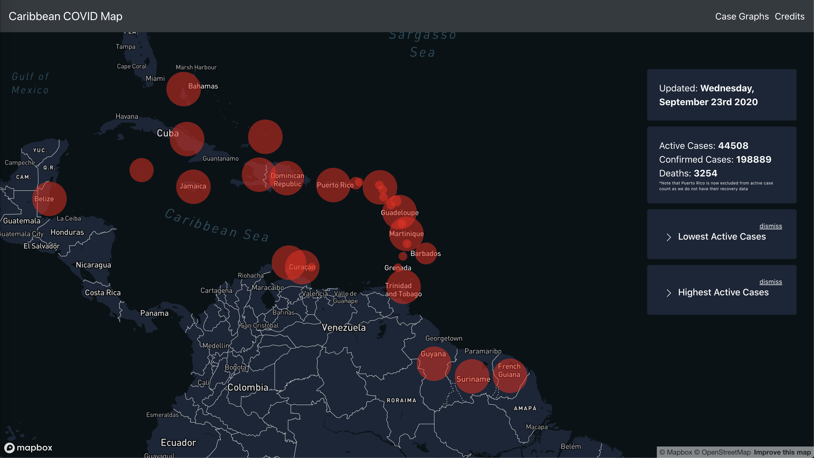
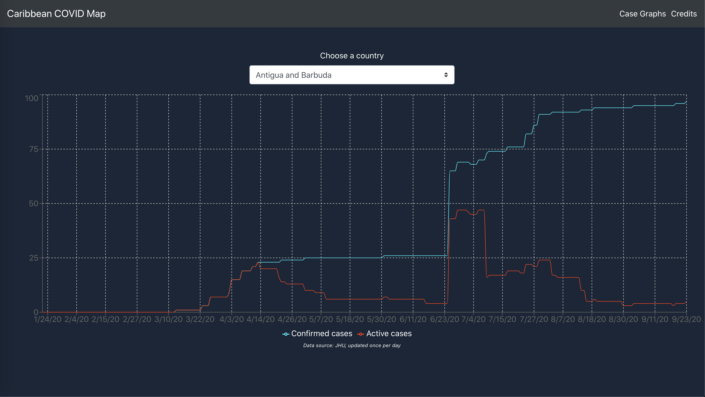

# caricovidmap
This is a map (live at caricovidmap.com) that aggregates Johns Hopkins University open global data, but with a focus on the Caribbean region. There are two main views. The map page which is the home page, and Case evolution graphs which plots the data over time on a graph.

## Motivation

Just about when the situation was evolving into a pandemic, a journalist contacted me lamenting the fact they as journalists, would have to go to Johns Hopkins site and manually sum up the Caribbean relevant data. Armed with the link to the open Johns Hopkins data, it quickly became clear that what they needed could easily be built.

## Build status

[](https://app.netlify.com/sites/determined-blackwell-e8c2d9/deploys)  www.caricovidmap.com 

## Screenshots



## Tech Stack

###### Frontend

<b>Built with</b>
- [React](https://reactjs.org/)

This was initialized using [create-react-app](https://reactjs.org/docs/create-a-new-react-app.html)

###### Backend
- there is almost no backend, in that the data is not persisted anywhere. This code be a future improvement. It's essentially a front end for Johns Hopkins data, with the exception of our own [CSV File](https://github.com/luvi/caricoviddata). 

For the Map page, the data is edited, corrected and in some cases merged with our own data. On the case graphs page, it is almost strictly a frontend on johns hopkins data with little to no editing.


## Code Example

The heart of the project is in the pages folder, in the Map.js file.

Once the componentDidMount, a series of promises are triggered by the core getCOVIDInfo() function. This chain sets the state of various data points that are used to display information on the Map page E.g
```
 getCOVIDInfo(url)
      .then((body) => {
        parse(body, (err, output) => {
          const arr = output;
          this.setState({ date: moment(_.last(arr[0])).format('dddd, MMMM Do YYYY') }); //date of latest entry
          johnsHopkinsData = arr.filter(isCaribbeanCountry);
          johnsHopkinsCountries = new Set();
        });
        return getCOVIDInfo(deathsSource);
      })
 ```

## Installation

Once you git clone this repo, an "npm start" would spin up a development server with a local instance.
Please use your own mapbox API token when running your own instance of the project. You have to replace the TOKEN in src/MAPBOX_ACCESS_TOKEN.js with your own, as it is restricted to only work on caricovidsite.com. You can grab one for free at [mapbox.com](https://account.mapbox.com/)

## Tests
Needed! See open issues.

## Contribute

Contributions are welcome, especially if you are a caribbean dev ;) Good beginner issues are labelled. Here is the [contributing guideline]() coming soon.

## Credits
Thank you [Clydeen McDonald](https://twitter.com/ClydeenMcdonald) for approaching me with your need!

## License


MIT © [Janique-ka]()

